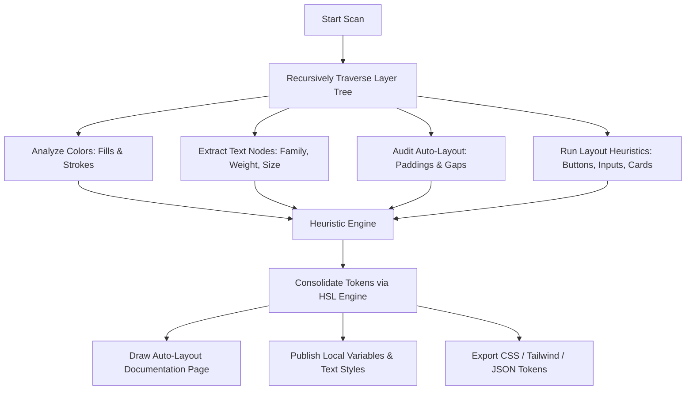

# Structura 🚀

[](https://www.figma.com/community/plugin/1638830227761815496)
[](https://www.typescriptlang.org/)
[](https://opensource.org/licenses/MIT)

**Structura** is an intelligent, automated Design System generator and audit engine for Figma. It scans messy design files, extracts layout and token heuristics, organizes components, registers native Figma variables, and exports ready-to-use developer configurations (Tailwind, CSS, JSON) instantly.

---

## 📖 Table of Contents
1. [Overview & Use Cases](#-overview--use-cases)
2. [Traditional Workflow vs. Structura](#-traditional-workflow-vs-structura)
3. [Problem & Solution Matrix](#%EF%B8%8F-problem--solution-matrix)
4. [How It Works (Under the Hood)](#-how-it-works-under-the-hood)
5. [Key Differences from Existing Plugins](#-key-differences-from-existing-plugins)
6. [Case Study: Nexus Enterprise Audit](#-case-study-nexus-enterprise-audit)
7. [Technical Specifications](#-technical-specifications)
8. [Installation & Local Development](#%EF%B8%8F-installation--local-development)
9. [Author & License](#-author--license)

---

## 🔍 Overview & Use Cases

Modern design workflows frequently suffer from "design drift." Over time, rapid prototyping leads to inconsistent colors, arbitrary font sizes, duplicate elements, and custom spacing. 

**Structura** acts as a automated bridge between unstructured design drafts and developer-ready codebases. 

### What is it used for?
* **Legacy UI Auditing:** Instantly scan dozens of design screens to reveal styling inconsistencies and duplicate values.
* **Rapid Design-System Bootstrapping:** Generate a visual design system catalog in seconds from standard high-fidelity mockups.
* **Automated Developer Handoff:** Extract CSS Variables, Tailwind extensions, and JSON Design Tokens in one click.
* **Figma Styles & Variables Registration:** Auto-create native Figma Variables and Paint/Text Styles directly from audited canvas layers.
* **Dynamic Theme Generation:** Automatically generate responsive, themed documentation frames colored dynamically by the primary brand colors found during scanning.

---

## 🔄 Traditional Workflow vs. Structura

Creating and maintaining a design system manually is an expensive, slow, and error-prone process. The table below highlights how Structura transforms the workflow:

| Feature / Process | Traditional Manual Workflow | Using Structura Plugin |
| :--- | :--- | :--- |
| **Auditing Assets** | Weeks of manually clicking layers, checking hex codes, and copy-pasting values into spreadsheets. | **Instant (4-5 seconds).** Recursively traverses every layer on a canvas page in one click. |
| **Token Consolidation** | Design leads manually group similar hex codes, creating a messy color table. | **Automated.** Uses HSL-based semantic heuristic ranges to bin values and suggest standardized token names. |
| **Figma Native Setup** | Manually creating dozens of Paint Styles, Text Styles, and Local Variables line-by-line. | **Single-click creation.** Instantly provisions Variable Collections and local typography styles. |
| **Handoff Generation** | Writing custom CSS classes and updating Tailwind config files manually, prone to typo errors. | **Ready-to-copy code.** Automatically exports CSS variables, Tailwind configurations, and JSON design tokens. |
| **Visual Documentation** | Designers spend hours or days aligning frames, adding headers, and displaying components nicely. | **Automated Layout.** Builds an auto-layout page (`Structura - Design System`) complete with swatches and metadata. |
| **Design-Code Sync** | High friction between design updates and dev implementations, causing visual drift. | **Zero friction.** Continuous rebuilds match designs directly to exportable config specs. |

---

## 🛠️ Problem & Solution Matrix

Structura resolves typical frictions in the design-to-code pipeline:

| Identified Problem | Direct Impact | Structura Solution |
| :--- | :--- | :--- |
| **Color & Font Bloat** | A site might have 12 slightly different shades of "white" or "dark grey" (#FFFFFF, #FAFAFA, #F9F9F9, etc.). | **Semantic HSL Grouping:** Automatically merges identical and closely aligned tones into single design tokens. |
| **Inconsistent Spacing** | Auto-layout paddings and item gaps ranging randomly from 7px to 19px. | **Spacing Token Extractor:** Scans all auto-layout containers, logs frequent sizes, and registers them as float variables (e.g. `space-8`, `space-12`). |
| **Hidden Asset Collections** | Icons and media elements get buried inside nested frame levels. | **Component/Icon Detectors:** Identifies layers by dimensions, vectors, and naming metrics, presenting them on a central board. |
| **Missing Visual Catalog** | Developers cannot quickly reference the overall structure and token availability of the design. | **Auto-Layout Board Builder:** Generates clean, well-spaced visual cards representing typography, colors, branding, and widgets. |
| **Slow Figma API Adoption** | Variable creation is tedious, causing teams to skip using native Figma variables. | **Native API Sync Engine:** Integrates directly with `figma.variables` to publish variables automatically. |

---

## ⚙️ How It Works (Under the Hood)

Structura operates using a modular pipeline that traverses the Figma layer tree:



### 1. The Traverser & Scanner
* Traverses the node graph asynchronously (`setTimeout` yielding to prevent UI freezing during large file parsing).
* Extracts fill colors, stroke styles, typography families, layout parameters, shadows, and assets.

### 2. Semantic Token Categorizer (HSL Engine)
* Converts RGB color models to HSL (Hue, Saturation, Lightness).
* Categorizes colors based on HSL thresholds (e.g., Saturation $< 12\%$ maps to Neutrals, Hue $195^\circ - 250^\circ$ maps to Brand Blues, etc.).
* Suggests standard semantic tokens (e.g., `neutral-100 / bg-subtle`, `primary-500 / brand-primary`, `success-500`).

### 3. Component & Asset Heuristics
* **Buttons:** Detects layers with widths $60\text{px}-320\text{px}$, heights $24\text{px}-64\text{px}$, aspect ratios $1.5-7.0$, containing $\le 2$ text layers.
* **Inputs:** Detects boxes with active borders or fills, widths $120\text{px}-500\text{px}$, heights $32\text{px}-60\text{px}$, containing label/placeholder texts.
* **Cards:** Identifies blocks with at least two text children and at least one visual element.
* **Logos & Icons:** Extracts elements based on name match patterns and vector shapes.

---

## 🥊 Key Differences from Existing Plugins

How does Structura compare with popular ecosystem tools?

* **VS. Tokens Studio (Figma Tokens):**
  * *Tokens Studio* is a powerful, manual configuration editor for token-centric design. It requires you to define and manage tokens by hand first. 
  * *Structura* is an **automated scanner**. It reverse-engineers legacy designs to *find* the tokens and components for you.
* **VS. Style Guide Generators:**
  * Most style guide generators simply draw a series of colored circles and font lists. 
  * *Structura* creates interactive visual guides using **pure Auto Layout and themed layouts**, automatically clones matching components, builds developer code segments, and provisions native Figma Variables.
* **VS. Standard Inspector Specs:**
  * Inspector views only show single-element properties.
  * *Structura* analyzes relationships, detects patterns (like standard spacing increments), and offers holistic code exports.

---

## 📈 Case Study: Nexus Enterprise Audit

> [!NOTE]
> This case study represents a real-world scenario of resolving design system debt inside an enterprise application.

### 1. Context & Challenges
Nexus Corp had an application consisting of over 80 active web mockups. Because dozens of freelancers and designers had worked on the file over 3 years, the project suffered from:
* **114 unique Hex codes** (including 22 slightly different shades of grey).
* **45 unique font configurations** (mixes of Inter, Arial, and system fonts with arbitrary sizes).
* No native Figma variables or styles used.
* Front-end developers spending hours auditing styles, writing inline values, and manually creating CSS rules.

### 2. The Solution
The design lead ran **Structura** against the core mockups page.
* **Execution Time:** 4.2 seconds (scanned 2,842 total layers).
* **Consolidation:** The plugin consolidated the 114 colors down to **15 core semantic swatches**.
* **Auto-Layout Building:** Generated a page named `Structura - Design System [All Pages]` detailing all styles.
* **Native Sync:** With a single click, registered the 15 colors as local variables under a collection called "Structura Variables" and created local Text Styles.

### 3. Developer Integration
The developers copied the exported Tailwind theme extensions:
```json
{
  "colors": {
    "brand-primary": "#6366F1",
    "bg-subtle": "#F3F4F6",
    "border": "#E5E7EB",
    "text-primary": "#111827"
  }
}
```
This saved the team an estimated **30+ hours of audit work** and eliminated visual discrepancies in the subsequent frontend release.

---

## 💻 Technical Specifications

The Structura codebase is split into the Figma Sandbox (`code.ts`) and the UI Sandbox (`ui.html`).

* **Core Engine:** TypeScript (compiled with `tsc`)
* **UI Interface:** Vanilla CSS with HSL color systems, Glassmorphism panels, and smooth micro-animations.
* **Capabilities:** 
  * Node tree traversal
  * Dynamic asset cloning
  * Native variables collection provisioning (`figma.variables.createVariableCollection`)
  * Color/Spacing/Typography mapping
  * Multi-format code compiler (CSS Custom Properties, Tailwind Config, JSON Tokens)

---

## ⚙️ Installation & Local Development

To run this plugin locally for testing or feature extensions:

### Prerequisites
Make sure you have Node.js and npm installed.

### 1. Install Dependencies
```bash
npm install
```

### 2. Compile TypeScript
To compile your TS files once:
```bash
npm run build
```

To watch for file changes and compile automatically:
```bash
npm run watch
```

### 3. Load the Plugin in Figma
1. Open the Figma desktop app.
2. Go to **Plugins** -> **Development** -> **Import plugin from manifest...**.
3. Select the `manifest.json` file inside this directory.

---

## 👥 Author & License

* **Author:** Shachi / addychannn
* **Contact:** [addychannn@gmail.com](mailto:addychannn@gmail.com)
* **License:** This project is licensed under the MIT License - see the LICENSE file for details.
